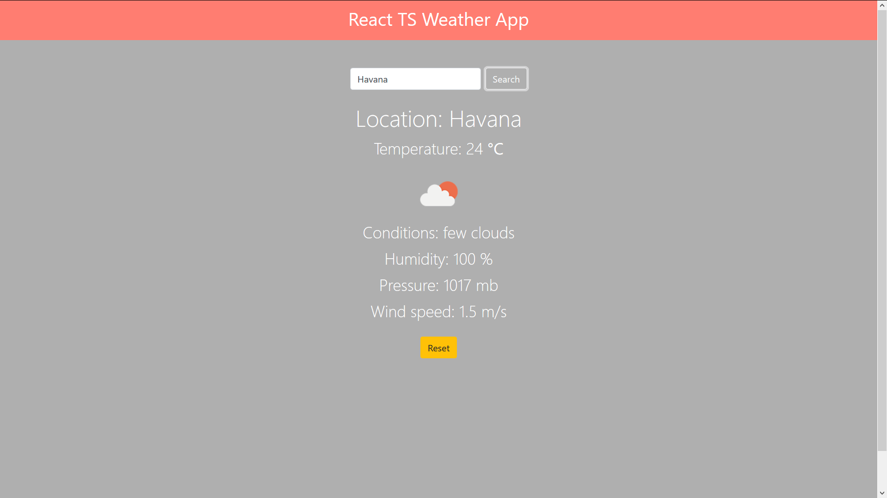
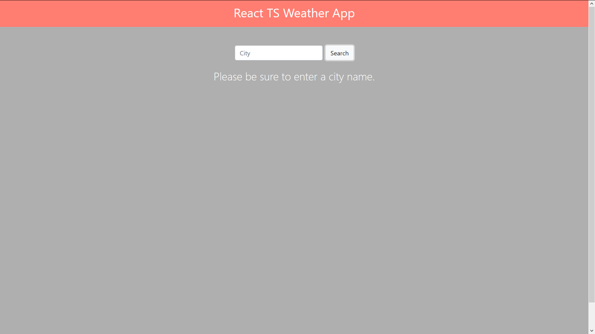
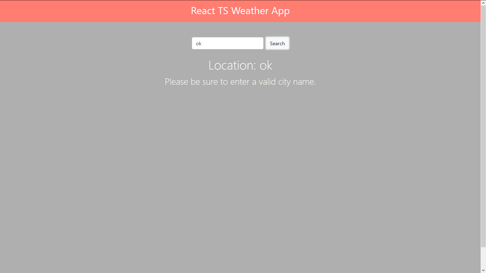

# Small Weather App

This is a small Weather App made with React, Typescript and Bootstrap 4 (CDN added to index.html). It uses OpenWeatherMap API, so in order to run the app you will need to create an account on their website and use your own API key (in the Form.tsx is located the name of that variable - myKey, so just insert yours instead of mine).

## Screenshots:
  
 

## Technologies: 
React, Typescript, Bootstrap 4